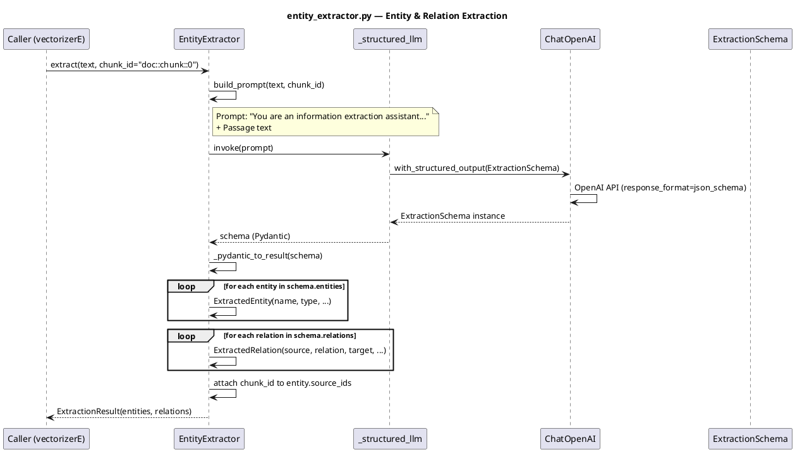

# entity_extractor.py — In-Depth Documentation

## Overview

The `entity_extractor` module extracts **named entities** and **relations** from chunk text using an LLM. It uses LangChain's `with_structured_output` for schema enforcement, producing structured JSON via Pydantic models.

---

## Architecture

### Data Flow

```
Chunk Text  ──►  EntityExtractor.extract()  ──►  ExtractionResult
                         │
                         ├── build_prompt(text, chunk_id)
                         ├── _structured_llm.invoke(prompt)
                         ├── _pydantic_to_result(schema)
                         └── attach chunk_id to entities
```

### Pydantic Schemas

| Schema | Purpose |
|--------|---------|
| `EntitySchema` | Single entity: name, type, description, aliases, source_ids |
| `RelationSchema` | Relation: source, relation, target, evidence |
| `ExtractionSchema` | Full result: entities, relations |

---

## API Reference

### Data Classes

#### ExtractedEntity

| Field | Type | Description |
|-------|------|-------------|
| `name` | str | Entity name |
| `type` | str | PERSON \| ORGANIZATION \| LOCATION \| EVENT \| OTHER |
| `description` | str | Concise description |
| `aliases` | List[str] | Alternative names |
| `source_ids` | List[str] | Chunk IDs where entity appears |

#### ExtractedRelation

| Field | Type | Description |
|-------|------|-------------|
| `source` | str | Source entity name |
| `relation` | str | Verb or relation phrase |
| `target` | str | Target entity name |
| `evidence` | str | Supporting quote |

#### ExtractionResult

| Field | Type | Description |
|-------|------|-------------|
| `entities` | List[ExtractedEntity] | Extracted entities |
| `relations` | List[ExtractedRelation] | Extracted relations |
| `raw_response` | Optional[Dict] | Error info if extraction failed |

---

### EntityExtractor Class

| Method | Description |
|--------|-------------|
| `__init__(llm=None, *, model="gpt-4o-mini", temperature=0.0, prompt_template=DEFAULT_PROMPT)` | Initialize with LLM or build default ChatOpenAI |
| `build_prompt(text, chunk_id=None)` | Render extraction prompt |
| `extract(text, chunk_id=None, extra_context=None)` | Run extraction and return `ExtractionResult` |
| `_pydantic_to_result(schema)` | Convert Pydantic schema to ExtractionResult |

---

## Configuration

- **Default model**: `gpt-4o-mini` (configurable via `PLAN_E_ENTITY_MODEL`)
- **Temperature**: 0.0
- **Dependencies**: `langchain-openai`, `pydantic`

---

## Usage Example

```python
from knowledge.entity_extractor import EntityExtractor, ExtractionResult

extractor = EntityExtractor(model="gpt-4o-mini", temperature=0.0)
result = extractor.extract(
    "Apple Inc. was founded by Steve Jobs in Cupertino.",
    chunk_id="doc::chunk::0"
)

for entity in result.entities:
    print(entity.name, entity.type)
for relation in result.relations:
    print(relation.source, relation.relation, relation.target)
```

---

## PlantUML Sequence Diagram


