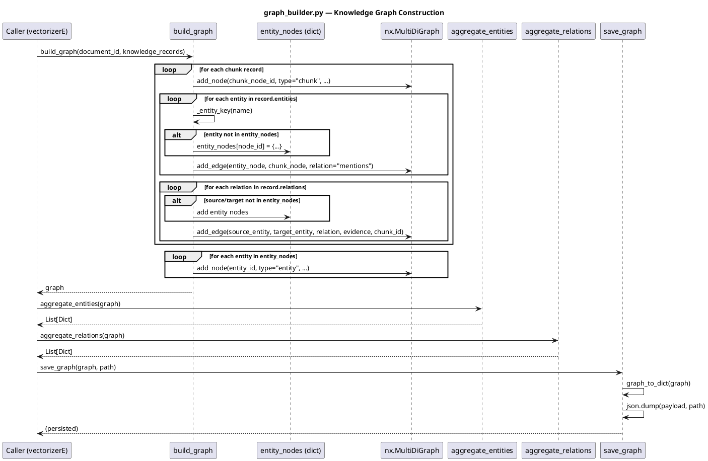

# graph_builder.py — In-Depth Documentation

## Overview

The `graph_builder` module builds an aggregated **knowledge graph** from chunk-level extraction records. It converts per-chunk entity/relation triples into a unified `networkx.MultiDiGraph` with entity nodes, chunk nodes, and edges for `mentions` and entity–entity relations.

---

## Architecture

### Data Flow

```
chunk_records  ──►  build_graph()  ──►  nx.MultiDiGraph
                           │
                           ├── Add chunk nodes
                           ├── Add entity nodes (deduplicated by _entity_key)
                           ├── Add entity→chunk "mentions" edges
                           └── Add entity→entity relation edges
```

---

## API Reference

### Functions

| Function | Signature | Description |
|----------|-----------|-------------|
| `build_graph` | `(document_id: str, chunk_records: Iterable[Dict]) -> nx.MultiDiGraph` | Build MultiDiGraph from chunk records |
| `graph_to_dict` | `(graph: nx.MultiDiGraph) -> Dict` | Serialize graph to dict (nodes, edges) |
| `aggregate_entities` | `(graph: nx.MultiDiGraph) -> List[Dict]` | Flat list of entity metadata |
| `aggregate_relations` | `(graph: nx.MultiDiGraph) -> List[Dict]` | Deduplicated relations with evidence |
| `save_graph` | `(graph: nx.MultiDiGraph, path: Path) -> None` | Persist graph as JSON |

---

## Graph Structure

### Node Types

| Type | ID Format | Attributes |
|------|-----------|------------|
| `chunk` | `chunk:<chunk_id>` | chunk_id, heading, section_path |
| `entity` | `entity:<normalized_name>` | name, entity_type, description, aliases, documents, source_chunks |

### Edge Types

| Relation | Source | Target | Attributes |
|----------|--------|--------|------------|
| `mentions` | entity | chunk | Links entity to chunk where it appears |
| *(custom)* | entity | entity | relation, evidence, chunk_id |

---

## Chunk Record Format

Each record in `chunk_records` should have:

```python
{
    "chunk_id": "doc::chunk::0",
    "heading": "...",
    "section_path": "...",
    "entities": [
        {"name": "...", "type": "PERSON", "description": "...", "aliases": [...], "source_ids": [...]}
    ],
    "relations": [
        {"source": "...", "relation": "...", "target": "...", "evidence": "..."}
    ]
}
```

---

## Aggregation Logic

- **Entity deduplication**: `_entity_key(name)` = `name.strip().lower()`
- **Entity nodes**: Merged across chunks; `source_chunks` and `documents` aggregated
- **Relations**: Deduplicated by (source, relation, target); evidence and chunk_ids collected

---

## PlantUML Sequence Diagram


