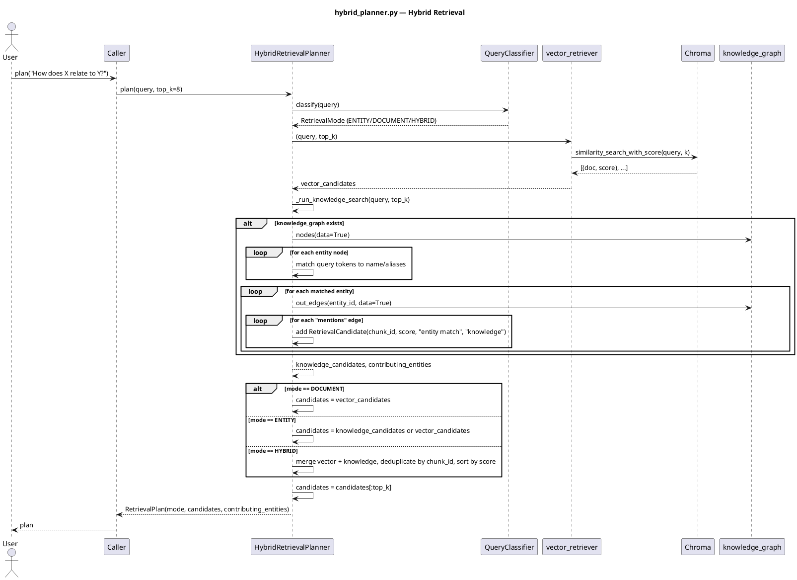

# hybrid_planner.py — In-Depth Documentation

## Overview

The `hybrid_planner` module combines **vector similarity search** and **knowledge-graph traversal** for retrieval. It classifies query intent (document vs entity vs hybrid) and returns ranked chunk candidates from both sources.

---

## Architecture

### Retrieval Modes

| Mode | Trigger | Behavior |
|------|---------|----------|
| `DOCUMENT` | Query matches document patterns (page, section, summary) | Use only vector search |
| `ENTITY` | Query matches entity patterns (relationship between, how ... related, compare) | Prefer knowledge search; fallback to vector |
| `HYBRID` | Default or both patterns match | Merge vector + knowledge candidates, deduplicate by chunk_id, rank by score |

---

## Components

### QueryClassifier

Heuristic classifier based on regex patterns:

- **Entity patterns**: `relationship between`, `how ... related`, `compare`
- **Document patterns**: `page`, `section`, `summary`

### HybridRetrievalPlanner

| Method | Description |
|--------|-------------|
| `__init__(vector_retriever, knowledge_graph, classifier=None, entity_node_type="entity", mention_relation="mentions")` | Initialize with vector retriever and optional knowledge graph |
| `plan(query, top_k=8)` | Classify query, run vector + knowledge search, merge and rank; return `RetrievalPlan` |

### Data Classes

| Class | Fields |
|-------|--------|
| `RetrievalCandidate` | chunk_id, score, reason, source ("vector" or "knowledge"), metadata |
| `RetrievalPlan` | mode, candidates, contributing_entities |

---

## Vector Retriever Contract

```python
VectorRetriever = Callable[[str, int], Sequence[Tuple[str, float, Dict]]]
# (query, k) -> [(chunk_id, score, metadata), ...]
```

Example with Chroma:

```python
def vector_retriever(query: str, k: int):
    docs = vector_store.similarity_search_with_score(query, k=k)
    return [(doc.metadata.get("chunk_index"), 1 - score, doc.metadata) for doc, score in docs]
```

---

## Knowledge Search Logic

1. Tokenize query (words > 2 chars)
2. Match entity nodes by name or aliases
3. Follow `mentions` edges from matched entities to chunk nodes
4. Collect chunk_ids; score by entity match; optionally boost if evidence present
5. Rank by score; return top_k

---

## Utility Function

| Function | Description |
|----------|-------------|
| `load_knowledge_graph(path: Path) -> Optional[nx.MultiDiGraph]` | Load graph from JSON (nodes, edges) |

---

## Usage Example

```python
from retrieval.hybrid_planner import HybridRetrievalPlanner, load_knowledge_graph
from pathlib import Path

output_dir = Path("output/doc")
kg = load_knowledge_graph(output_dir / "knowledge" / "doc_knowledge_graph.json")

planner = HybridRetrievalPlanner(vector_retriever, kg)
plan = planner.plan("How does Vendor X relate to renewal delays?")

print(plan.mode)  # ENTITY or HYBRID
for c in plan.candidates:
    print(c.chunk_id, c.score, c.reason, c.source)
```

---

## PlantUML Sequence Diagram


