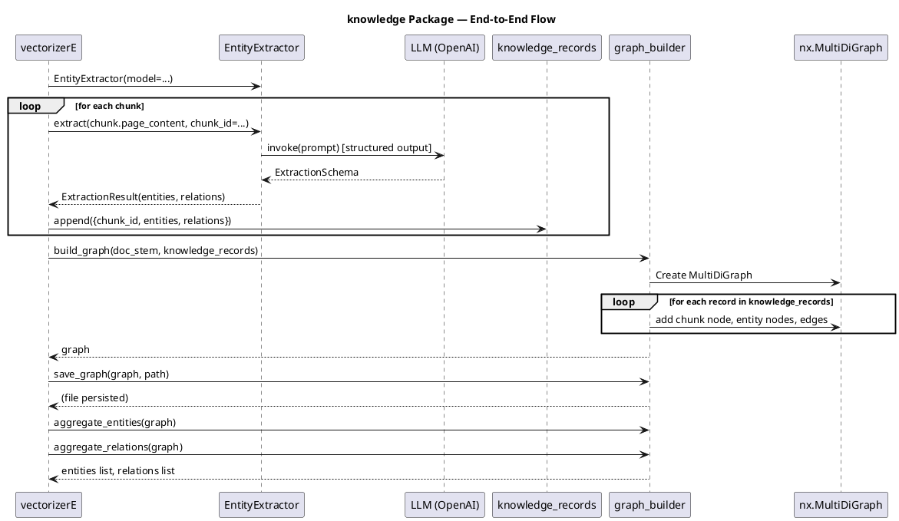

# knowledge Package — Overview

## Purpose

The `knowledge` package provides **entity extraction** and **knowledge graph construction** for the document understanding pipeline. It turns unstructured chunk text into a structured graph of entities and relations.

---

## Package Structure

```
knowledge/
├── __init__.py          # Package exports
├── entity_extractor.py  # LLM-based entity/relation extraction
└── graph_builder.py     # Knowledge graph construction
```

---

## Module Summary

| Module | Responsibility |
|--------|----------------|
| **entity_extractor** | Use LLM (ChatOpenAI) to extract entities and relations from chunk text; return `ExtractionResult` |
| **graph_builder** | Take chunk-level extraction records and build an aggregated `nx.MultiDiGraph` with entities and relations |

---

## Data Flow (End-to-End)

```
Chunk Text
    │
    ▼  EntityExtractor.extract()
ExtractionResult (entities, relations)
    │
    ▼  Collect per chunk as knowledge_records
List[Dict] (chunk_id, entities, relations)
    │
    ▼  graph_builder.build_graph()
nx.MultiDiGraph (entity nodes, chunk nodes, mentions, relations)
    │
    ▼  graph_builder.save_graph()
JSON file (*_knowledge_graph.json)
```

---

## Integration with vectorizerE

1. For each chunk, `vectorizerE` calls `EntityExtractor.extract(chunk.page_content, chunk_id=...)`.
2. Extracted entities/relations are stored as `knowledge_records`.
3. After all chunks are processed, `graph_builder.build_graph(doc_stem, knowledge_records)` builds the graph.
4. The graph is saved with `graph_builder.save_graph(knowledge_graph, path)`.
5. `graph_builder.aggregate_entities()` and `graph_builder.aggregate_relations()` provide flat lists for downstream use.

---

## Dependencies

- **entity_extractor**: `langchain-openai`, `pydantic`
- **graph_builder**: `networkx`

---

## PlantUML Sequence Diagram — Knowledge Package Flow


