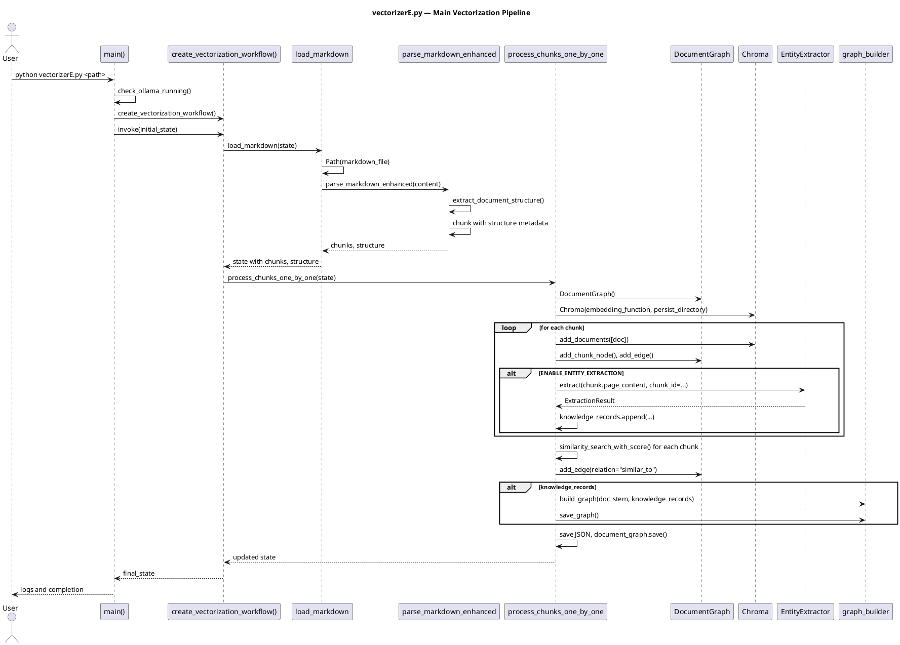

# vectorizerE.py — In-Depth Documentation

## Overview

`vectorizerE.py` is the main ingestion pipeline for the graph-based document understanding system. It:

1. Loads and parses Markdown files
2. Chunks content with structure-aware metadata (sections, headers, tables)
3. Generates embeddings via Ollama (nomic-embed-text:v1.5)
4. Stores vectors in Chroma
5. Builds a document graph (sections, chunks, `follows`/`contains`/`similar_to` edges)
6. Optionally extracts entities and relations per chunk via an LLM
7. Aggregates knowledge into a knowledge graph

---

## Architecture

### Workflow (LangGraph)

```
load_markdown  ──►  process_chunks_one_by_one  ──►  END
```

- **load_markdown**: Parse Markdown, extract structure, chunk with metadata
- **process_chunks_one_by_one**: Embed, build document graph, extract entities, compute similarity edges, save outputs

### State (VectorizerState)

| Field | Type | Description |
|-------|------|-------------|
| `markdown_file` | str | Path to Markdown file or folder |
| `document_path` | str | Resolved path to Markdown file |
| `chunks` | List[Document] | Parsed chunks with metadata |
| `structure` | Dict | Extracted structure (sections, headers, tables) |
| `processed_chunks` | List[Dict] | Per-chunk details (content, metadata, etc.) |
| `vector_store` | Chroma | Vector store instance |
| `document_graph` | DocumentGraph | Section/chunk graph |
| `json_mapping` | List[Dict] | Chunk mapping for downstream use |
| `output_folder` | str | Output folder path |
| `output_root` | str | Root output directory (default: `output`) |
| `document_output_dir` | str | Path to `output/<doc>/` |
| `token_usage` | Dict | Token statistics |

---

## Key Components

### TokenTracker

Tracks token usage and enforces embedding limits:

- `count_tokens(text)` — Estimate token count (tiktoken or fallback)
- `check_embedding_limit(text)` — Truncate if over limit; return `(text, was_truncated)`
- `get_stats()` / `reset_stats()` — Token usage stats

### DocumentGraph

Directed graph for document structure:

- **Nodes**: `section:<path>`, `chunk:<id>`
- **Edges**: `contains`, `belongs_to`, `follows`, `similar_to`
- Methods: `add_section_node`, `add_chunk_node`, `add_edge`, `get_parent_section`, `get_section_chunks`, `get_adjacent_chunks`, `get_similar_chunks`, `expand_from_chunks`, `save`, `load`

### Document Structure Extraction

- **extract_document_structure(markdown_content)** — Returns `{ sections, headers, tables }`
- **get_section_for_line(line_number, structure)** — Most specific section containing a line

### Chunking

- **parse_markdown_enhanced(markdown_content)** — Structure-aware chunking with overlap
- **create_enhanced_chunk(...)** — Build chunk with heading, section_path, table metadata
- **is_chunk_empty(chunk)** — Filter minimal/empty chunks

---

## Configuration

| Variable | Default | Description |
|----------|---------|-------------|
| `EMBEDDING_MODEL` | nomic-embed-text:v1.5 | Ollama embedding model |
| `OLLAMA_BASE_URL` | http://localhost:11434 | Ollama server URL |
| `ENTITY_EXTRACTION_MODEL` | gpt-4o-mini | Chat model for entity extraction (`PLAN_E_ENTITY_MODEL`) |
| `ENABLE_ENTITY_EXTRACTION` | 1 | Enable/disable entity extraction (`PLAN_E_ENABLE_ENTITY_EXTRACTION`) |
| `CHUNK_SIZE` | 2000 | Max characters per chunk |
| `CHUNK_OVERLAP` | 150 | Overlap between chunks |
| `EMBEDDING_MAX_CHARS` | 2000 | Max chars for embedding |
| `EMBEDDING_MAX_TOKENS` | 1500 | Max tokens for embedding |

---

## Output Files

| Path | Description |
|------|-------------|
| `output/<doc>/vector_db/<doc>/` | Chroma persistence |
| `output/<doc>/<doc>_vector_mapping.json` | Chunk metadata and content |
| `output/<doc>/<doc>_document_graph.json` | Document graph (nodes, edges) |
| `output/<doc>/knowledge/<doc>_chunk_knowledge.json` | Per-chunk entity/relation extraction |
| `output/<doc>/knowledge/<doc>_knowledge_graph.json` | Aggregated knowledge graph |

---

## PlantUML Sequence Diagram


